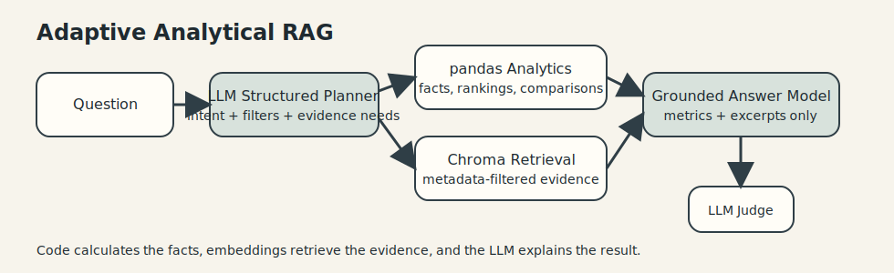

# Disneyland Review Analytics And QA

This repository packages a take-home style analysis of Disneyland customer reviews and a grounded natural-language QA prototype built on the same cleaned dataset.

Two notebooks are the main entry points:

- `assignment.ipynb`: business-facing analysis covering cleaning, metadata exploration, text-based insights, recommendations, system overview, and a short evaluation summary.
- `qa_demo.ipynb`: interactive QA showcase with planner inspection, deterministic analytics, Chroma retrieval evidence, optional judge scoring, and a small benchmark.



The core design principle is:

> Code calculates the facts, embeddings retrieve the evidence, and the LLM explains the result.

## Architecture

Question  
→ LLM structured planner  
→ LangGraph orchestration  
→ pandas deterministic analytics  
→ Chroma semantic retrieval  
→ grounded LLM answer

Why the design moved beyond TF-IDF-only retrieval:

- TF-IDF is useful for lexical overlap, but it struggles on analytical questions like “best time to visit” that require comparisons and rankings before retrieval.
- Chroma plus embeddings improves semantic evidence retrieval.
- Embeddings do not replace analytics; `pandas` remains the source of truth for counts, averages, rankings, and comparisons.

## Setup

1. Create a Python environment and install dependencies:

```bash
pip install -r requirements.txt
```

2. Copy the example environment file and set your key when you want planner and answer-model calls:

```bash
cp .env.example .env
```

3. Set or export `OPENAI_API_KEY`.

The main configurable variables are:

- `OPENAI_API_KEY`
- `PLANNER_MODEL`
- `ANSWER_MODEL`
- `JUDGE_MODEL`
- `EMBEDDING_PROVIDER`
- `OPENAI_EMBEDDING_MODEL`
- `LOCAL_EMBEDDING_MODEL`

## Chroma Index

The vector index persists locally under `artifacts/chroma/disney_reviews`.

- If a valid index already exists, the code reuses it.
- If the dataset fingerprint or embedding configuration changes, the index is rebuilt automatically.

## Notebooks

Open the notebooks in this order:

1. `assignment.ipynb`
2. `qa_demo.ipynb`

`assignment.ipynb` is the business-analysis deliverable.  
`qa_demo.ipynb` is the interactive system and evaluation showcase.

## Tests

Run the automated tests with:

```bash
python -m unittest discover -s tests -p "test_*.py" -v
```

## Evaluation

Deterministic evaluation:

```python
from src.evaluation import load_evaluation_cases, run_evaluation
from src.qa import build_qa_engine

engine = build_qa_engine(dataset_path="DisneylandReviews.csv")
cases = load_evaluation_cases()
results = run_evaluation(engine, cases, use_llm_judge=False)
```

Enable the LLM judge only when you want an answer-quality check and have an API key configured. The judge model is separate from the answer model by default.

## Limitations

- The dataset is historical and not a live operations feed.
- Simple calendar seasons do not capture local climate or holiday effects.
- Aspect tagging in the analysis notebook is intentionally lightweight and explainable.
- Questions that require ticket prices, weather, holidays, or live crowd levels are explicitly treated as unsupported external context.
- LLM-as-a-judge is useful as a consistency check, not as unquestionable ground truth.
